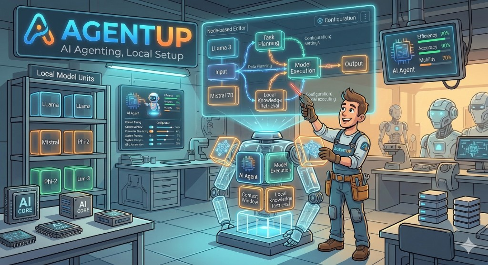

<p align="center">
  
</p>

# AgentUp

`agentup-cli` is a CLI that scaffolds AI agent context files for your project.
The goal is to avoid rewriting the same setup instructions in every repository.

## What It Generates
Based on selected providers, AgentUp creates:
- `AGENTS.md`
- `CLAUDE.md` and `.claude/*` (when Claude is selected)
- `.cursor/*` (when Cursor is selected)
- `.agentup.json` (generator manifest)

## Quick Start
### 1) Install Globally
```bash
npm install -g agentup-cli
agentup-cli init
```

### 2) Run Without Installing
```bash
npx agentup-cli@latest init
```

## Usage
```bash
cd your-project
agentup-cli init
```

The CLI prompts you for:
- providers (Claude/Codex/Cursor/Gemini/Antigravity)
- IDE
- auto-detect or manual mode
- roles (`plan`, `review`, `test`, `code`)
- overwrite mode (`skip` or `replace`)
- project stack details (language, framework, database, commands)

## Core Commands
```bash
agentup-cli init        # Interactive scaffolding
agentup-cli __selftest  # Built-in self-tests
agentup-cli --help      # Help
```

## Example Output Structure
```text
your-project/
├── AGENTS.md
├── .agentup.json
├── CLAUDE.md          # only if Claude is selected
├── .claude/           # only if Claude is selected
└── .cursor/           # only if Cursor is selected
```

## License
MIT
